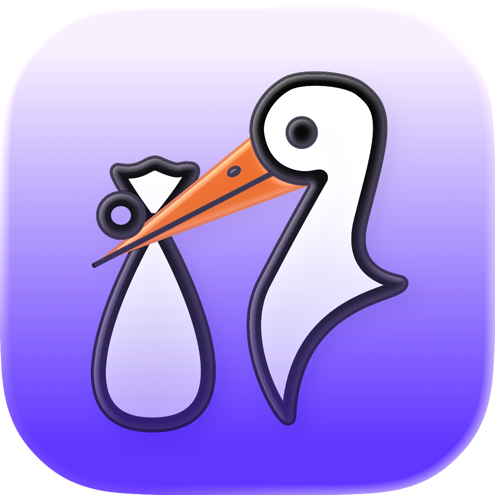

   

# Stork

A professional iOS app for healthcare professionals to track baby deliveries and maintain career statistics.

## Overview

Stork helps nurses, midwives, and obstetricians track deliveries with comprehensive data capture, career milestone tracking, and rich analytics. Built with SwiftUI and SwiftData, it features seamless iCloud sync, HealthKit integration, and home screen widgets.

## Features

### Delivery Tracking
- Record deliveries with method (vaginal, C-section, VBAC), epidural usage, and notes
- Track multiple babies per delivery with sex, weight, height, and NICU status
- Custom tagging system with 10 presets and unlimited custom tags
- Historical entry support (up to 3 days back)

### Analytics Dashboard
- **Marble Jar**: Interactive SpriteKit visualization of monthly deliveries with device tilt physics
- **Reorderable Cards**: 9 insight cards including delivery methods, epidural usage, time-of-day patterns, year-over-year trends, and personal bests
- Calendar view with delivery heat map

### Career Milestones
- Automatic detection and celebration of milestones (100, 500, 1,000+ babies)
- Shareable milestone cards for social media

### Data Export
- **PDF Reports**: Professional summaries with embedded charts
- **CSV Export**: Per-delivery or per-baby formats with unit conversion
- Configurable date formats and metric/imperial units

### Platform Integration
- **iCloud Sync**: Seamless multi-device synchronization via CloudKit
- **HealthKit**: Step count tracking during shifts
- **WeatherKit**: Weather conditions at time of delivery
- **Widgets**: Home screen and lock screen widgets for quick stats
- **Apple Watch**: Companion app for quick entry and today's stats

## Requirements

- iOS 18.0+
- Xcode 16.0+
- Apple Developer account (for CloudKit and HealthKit capabilities)

## Setup

1. Clone the repository
2. Open `Stork.xcodeproj` in Xcode
3. Configure signing with your Apple Developer account
4. Update bundle identifiers and App Group/iCloud container identifiers
5. Build and run

### Required Capabilities

Enable these in your Xcode project:
- iCloud (CloudKit with private database)
- HealthKit
- App Groups
- WeatherKit
- Background Modes (location, remote notifications, fetch)

## Architecture

### App Lifecycle

The app progresses through stages managed by `ContentView`:

```
.splash → .onboarding → .syncing → .main
```

### Manager Pattern

Business logic lives in `@MainActor @Observable` manager classes:

| Manager | Responsibility |
|---------|---------------|
| `DeliveryManager` | CRUD operations, filtering, milestones, widget updates |
| `HealthManager` | HealthKit authorization and step count streaming |
| `LocationManager` | One-shot and continuous location via async/await |
| `WeatherManager` | WeatherKit with 1-hour refresh cooldown |
| `CloudSyncManager` | iCloud sync status and network monitoring |
| `ExportManager` | PDF/CSV generation orchestration |

### Data Layer

- **SwiftData** with iCloud CloudKit sync
- **App Groups** for widget data sharing
- **AppStorage** for user preferences

### Key Patterns

- **Dependency Injection**: Managers injected via SwiftUI `@Environment`
- **Async Bridging**: `CheckedContinuation` converts delegate callbacks to async/await
- **AsyncStream**: Continuous updates for location and health data

## Project Structure

```
Stork/
├── StorkApp.swift              # App entry point
├── ContentView.swift           # App stage state machine
├── Managers/                   # Business logic
├── Models/                     # SwiftData models
├── Views/
│   ├── Splash/                 # Launch screen
│   ├── Onboarding/             # Permission flow
│   ├── Main/
│   │   ├── Home/               # Dashboard with cards
│   │   │   ├── Cards/          # Analytics cards
│   │   │   └── Jar/            # SpriteKit marble jar
│   │   ├── Deliveries/         # List, entry, detail views
│   │   ├── Calendar/           # Calendar view
│   │   ├── Export/             # PDF/CSV export
│   │   └── Settings/           # Preferences
├── Services/                   # CSV, PDF, image export
├── Errors/                     # LocalizedError types
└── Resources/                  # Assets, app icons

StorkWidgets/                   # Home screen widgets
StorkWatch Watch App/           # watchOS companion
```

## Privacy

Stork is designed with privacy in mind:
- All data stored in your private iCloud container
- Location accuracy limited to 100 meters
- No analytics or tracking
- No hospital data stored (removed for HIPAA considerations)

## License

This project is licensed under the MIT License - see the [LICENSE](LICENSE) file for details.

## Author

Molargik Software LLC
