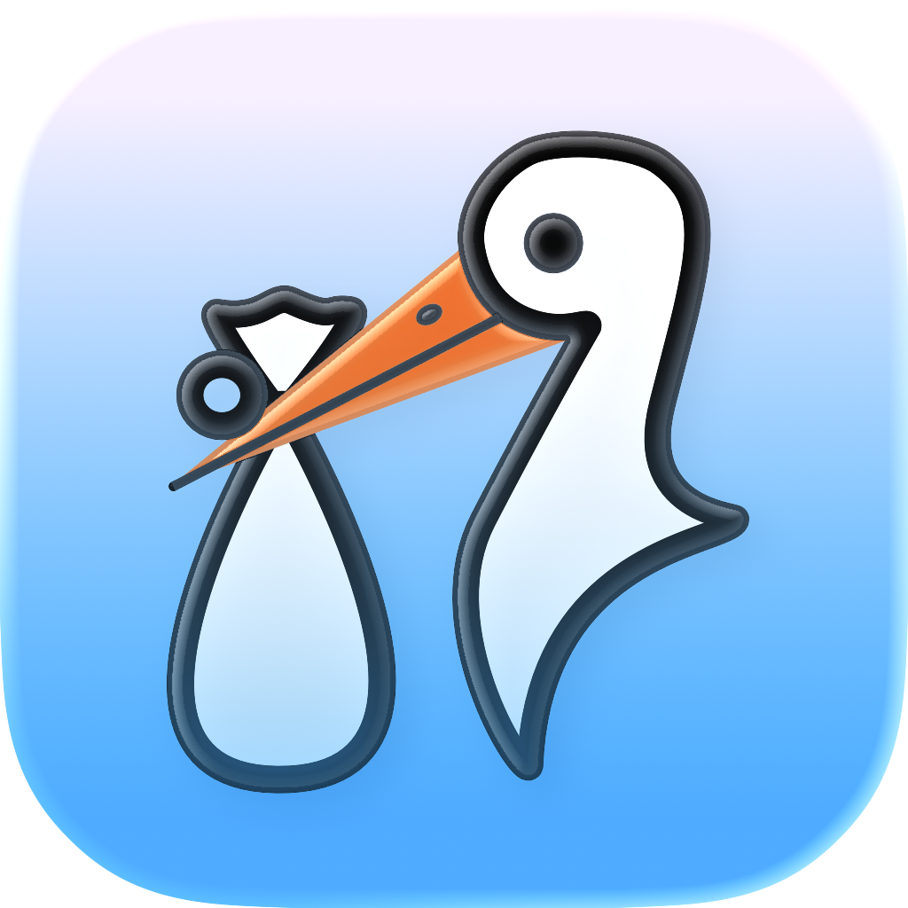
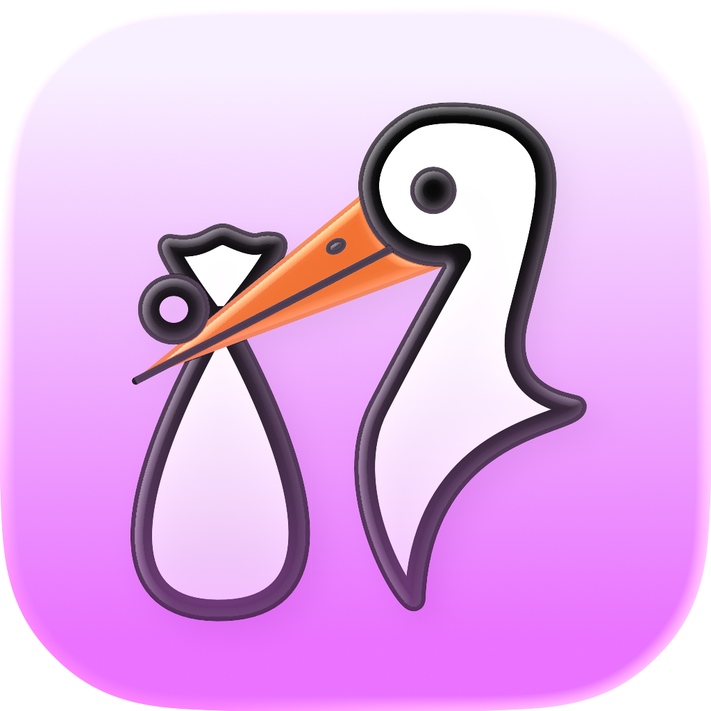
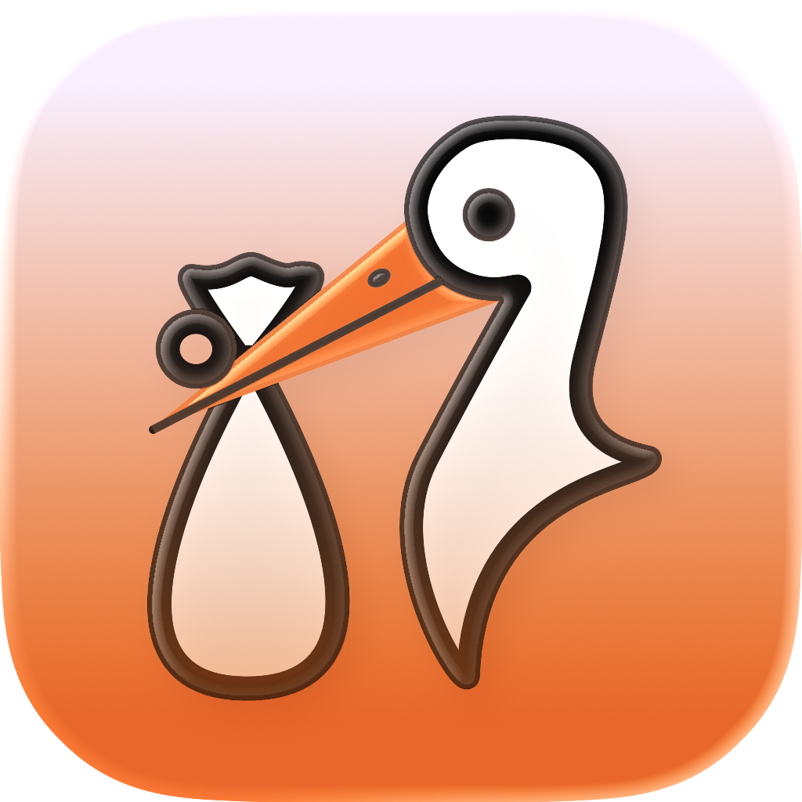
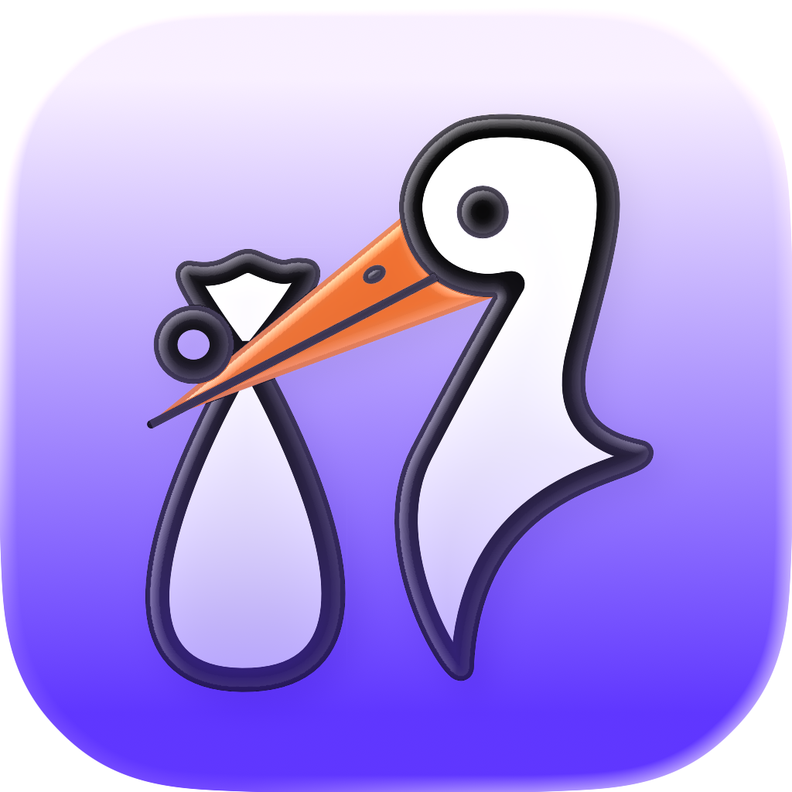

   

# Stork

A professional iOS app for healthcare professionals to track baby deliveries and maintain career statistics.

## Overview

Stork helps nurses, midwives, and obstetricians track deliveries with comprehensive data capture, career milestone tracking, and rich analytics. Built with SwiftUI and SwiftData for iOS 27, it features seamless iCloud sync, HealthKit integration, Siri and Shortcuts support, home screen widgets, and an Apple Watch companion.

## Features

### Delivery Tracking
- Record deliveries with method (vaginal, C-section, VBAC), epidural usage, and notes
- Track multiple babies per delivery with sex, weight, height, and NICU status
- Custom tagging system with presets and unlimited custom tags
- Search plus a unified filter pipeline across methods, tags, and date ranges

### Analytics Dashboard
- **Marble Jar**: Interactive SpriteKit visualization of monthly deliveries with device tilt physics
- **Reorderable Cards**: Insight cards including delivery methods, epidural usage, time-of-day patterns, year-over-year trends, and personal bests
- Calendar view with delivery heat map

### Career Milestones
- Automatic detection and celebration of milestones (100, 500, 1,000+ babies)
- Shareable milestone cards for social media

### Data Export
- **PDF Reports**: Professional summaries with embedded charts
- **CSV Export**: Per-delivery or per-baby formats with unit conversion
- Configurable date ranges and metric/imperial units

### Platform Integration
- **iCloud Sync**: Seamless multi-device synchronization via CloudKit
- **Siri & Shortcuts**: App Intents to log a delivery, check babies-this-week, and review career totals — plus `stork://` deep links and Spotlight indexing
- **HealthKit**: Step count tracking during shifts
- **WeatherKit**: Weather conditions at time of delivery
- **Widgets**: Home screen and lock screen widgets for quick stats
- **Apple Watch**: Companion app for quick entry and today's stats
- **Localization**: English, Spanish, French (Canada), and Japanese

## Requirements

- iOS 27.0+ / watchOS 27.0+ (also runs on Apple Vision as "Designed for iPad")
- Xcode 27 beta (iOS 27 SDK)
- Apple Developer account (for CloudKit and HealthKit capabilities)

## Setup

1. Clone the repository
2. **Open `Stork.xcworkspace`** (not the bare `.xcodeproj`) — it resolves the local Swift package
3. Configure signing with your Apple Developer account
4. Update bundle identifiers and App Group/iCloud container identifiers
5. Build and run

### Required Capabilities

Enable these in your Xcode project:
- iCloud (CloudKit with private database)
- HealthKit (including background delivery)
- App Groups
- WeatherKit
- Background Modes (location, remote notifications, fetch)

## Architecture

Stork is a **thin app target on top of an SPM umbrella package** (`Packages/Stork`) of layered, single-responsibility modules. Dependencies point inward: features depend on the design system and core; data implements core's protocols; core depends on nothing.

```
Stork (app target — thin shell) · StorkWidgetsExtension · StorkWatch
    └── StorkComposition        SessionController (composition root) + RootView/MainView
            ├── StorkFeature*   Deliveries · Dashboard · Onboarding · Settings · Export
            ├── StorkServices   Weather / Location / Health managers + seams
            ├── StorkData       SwiftData repositories · CloudKit store · cloud sync
            ├── StorkDesignSystem  brand colors · glass · haptics · toasts · stat views
            └── StorkCore       models · statistics · protocols · navigation (pure)
```

### Key Components

| Component | Responsibility |
|-----------|---------------|
| `SessionController` | Composition root: builds the dependency graph and vends per-screen view models |
| `DeliveryRepository` / `TagRepository` | Protocol boundaries over SwiftData, consumed through single-verb use-cases with typed errors |
| `DeliveryStatistics` | Pure, injectable-clock statistics behind every dashboard card |
| `MilestoneTracker` / `WeekMath` | Milestone detection and the single source of truth for Sunday–Saturday weeks |
| `WeatherManager` / `LocationManager` / `HealthManager` | System-framework services behind protocol seams (1-hour weather cooldown) |
| `CloudSyncManager` | iCloud sync status and CloudKit import notifications |

### Key Patterns

- **Repositories + use-cases**: views never touch SwiftData; every read/write goes through a single-verb use-case (`LogDelivery`, `LoadCareerTotals`, …) with typed `throws(PersistenceError)`
- **Observable view models over protocol seams**: each feature screen is backed by a cross-platform `@Observable` model, unit-tested on macOS against in-memory fakes — no simulator required
- **Change stream**: one multicast `AsyncStream` notifies every screen after each successful write, including CloudKit imports
- **Side effects in one place**: each save runs its widget refresh, Spotlight reindex, app-group counts, and review-prompt logic inside the repository

### Data Layer

- **SwiftData** with iCloud CloudKit sync (`Delivery`, `Baby`, `DeliveryTag`)
- **App Groups** for widget data sharing
- **AppStorage** for user preferences

## Project Structure

```
Stork.xcworkspace               # Open this
├── Stork/                      # Thin app target
│   ├── StorkApp.swift          # Session wiring, ~40 lines
│   └── Intents/                # App Intents, entities, Spotlight indexer
├── Packages/Stork/             # The real app (SPM umbrella package)
│   ├── Sources/
│   │   ├── StorkCore/          # Models, domain, protocols, navigation
│   │   ├── StorkData/          # SwiftData repositories, CloudKit store
│   │   ├── StorkServices/      # Weather, location, health
│   │   ├── StorkDesignSystem/  # Colors, glass, haptics, toasts
│   │   ├── StorkFeatureDeliveries/   # List, entry, detail
│   │   ├── StorkFeatureDashboard/    # Cards, marble jar, calendar
│   │   ├── StorkFeatureOnboarding/
│   │   ├── StorkFeatureSettings/
│   │   ├── StorkFeatureExport/       # PDF/CSV
│   │   └── StorkComposition/   # SessionController, RootView, MainView
│   └── Tests/                  # Host-run suite (swift test, no simulator)
├── StorkTests/                 # App-glue tests (hosted)
├── StorkWidgets/               # Home screen widgets
├── StorkWatch Watch App/       # watchOS companion
└── Scripts/                    # Localization pinning tooling
```

## Testing

The bulk of the suite lives in the package and runs on the Mac host in seconds — no simulator:

```sh
cd Packages/Stork && swift test
```

Domain, repositories, services, and feature view models (over fake use-cases) are all covered there. The hosted `StorkTests` target covers app-target glue only.

## Privacy

Stork is designed with privacy in mind:
- All data stored in your private iCloud container
- No patient-identifying data captured
- Location accuracy limited to 100 meters
- No analytics or tracking
- No hospital data stored (removed for HIPAA considerations)

## License

This project is licensed under the MIT License - see the [LICENSE](LICENSE) file for details.

## Author

Molargik Software LLC
